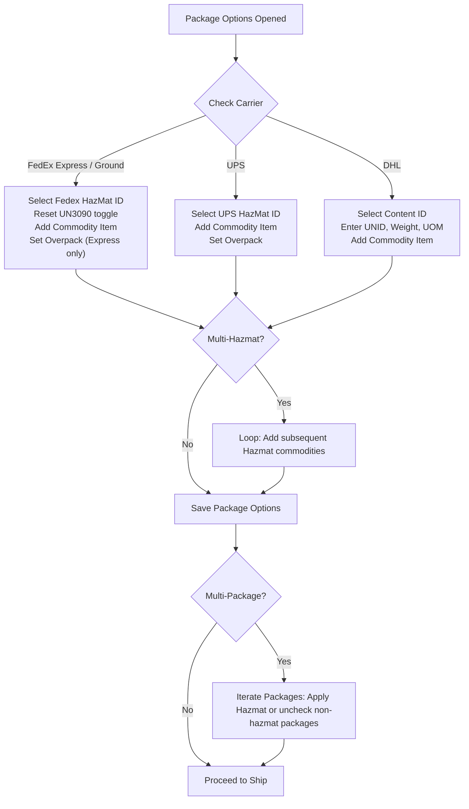

# Multi-Carrier Shipping & Automation Feature Matrix
## EBS Automation Codebase Reference Document

> **Document Purpose**: This document provides a complete, exhaustive catalog of all features, workflows, carrier services, payment methods, package options, documents, and validations implemented in this automation project (`EBS_automationcode`). It serves as an authoritative specification for other projects integrating or testing with ShipConsole and enterprise shipping systems.
>
> **Project Scope**: Enterprise Business Suite (EBS) Shipping automation built with **Playwright**, **Node.js**, **QZ Tray ZPL Printing**, and **PDF Document Parsing**.

---

## Table of Contents
1. [Carrier Summary & Comparison Matrix](#1-carrier-summary--comparison-matrix)
2. [Carrier-Specific Features](#2-carrier-specific-features)
   - [2.1 FedEx Express (Federal Express)](#21-fedex-express-federal-express)
   - [2.2 FedEx Ground & Home Delivery (FDXG)](#22-fedex-ground--home-delivery-fdxg)
   - [2.3 FedEx SmartPost](#23-fedex-smartpost)
   - [2.4 FedEx Freight (FXFR / LTL)](#24-fedex-freight-fxfr--ltl)
   - [2.5 UPS (United Parcel Service)](#25-ups-united-parcel-service)
   - [2.6 DHL Express](#26-dhl-express)
   - [2.7 BTX Global Logistics (LTL)](#27-btx-global-logistics-ltl)
3. [Cross-Carrier Functional Modules](#3-cross-carrier-functional-modules)
4. [Test Data Configuration & Schema](#4-test-data-configuration--schema)
5. [Architectural Patterns for Other Projects](#5-architectural-patterns-for-other-projects)

---

## 1. Carrier Summary & Comparison Matrix

| Feature / Capability | FedEx Express | FedEx Ground | FedEx SmartPost | FedEx Freight (FXFR) | UPS | DHL Express | BTX Logistics |
| :--- | :---: | :---: | :---: | :---: | :---: | :---: | :---: |
| **Total Test Cases** | 60 | 46 | 1 | 16 | 33 | 20 | 1 |
| **Domestic Shipping** | Yes | Yes | Yes | Yes | Yes | Yes | Yes |
| **International Shipping** | Yes | Yes | No | Yes | Yes | Yes | No |
| **Prepaid Payment** | Yes | Yes | Yes | Yes | Yes | Yes | Yes |
| **Recipient Payment** | Yes | Yes | No | No | Yes | Yes | No |
| **Third Party Billing (TPB)** | Yes | Yes | No | Yes | Yes (Modal) | Yes (Modal) | No |
| **Collect / Consignee** | No | Yes | No | No | Yes | No | No |
| **Single Hazmat** | Yes | Yes | No | No | Yes | Yes | No |
| **Multi-Hazmat** | Yes | Yes | No | No | Yes | Yes | No |
| **Overpack Option** | Yes | No | No | No | Yes | No | No |
| **DG Form / OP900** | Yes (DG) | Yes (OP900) | No | No | Yes (DG) | No | No |
| **Return Shipping** | Yes | Yes | No | No | Yes | No | No |
| **Dry Ice Shipping** | Yes | No | No | No | Yes | No | No |
| **Medical Indicator** | No | No | No | No | Yes | No | No |
| **Signature Options** | Yes (4 types) | Yes (4 types) | No | No | No | No | No |
| **Cash on Delivery (COD)** | No | No | No | No | Yes | No | No |
| **SmartPost Indicia/Endorse** | No | No | Yes | No | No | No | No |
| **MPS (Multi-Piece)** | Yes | Yes | No | Yes | Yes | Yes | No |
| **MPS Batches** | Yes | Yes | No | No | No | No | No |
| **Post-Shipment Packages** | Yes | Yes | No | No | Yes | No | No |
| **LPN Shipping** | Yes | Yes | No | No | Yes | Yes | No |
| **Delivery Consolidation** | Yes | No | No | No | No | No | No |
| **LTL / Freight Page** | No | No | No | Yes | No | No | Yes |
| **Multi-Pallet Freight** | No | No | No | Yes | No | No | No |
| **Additional Services** | No | No | No | Yes | No | No | Yes |
| **Bill of Lading (BOL)** | No | No | No | Yes | No | No | Yes |
| **Commercial Invoice (CI)** | Yes | Yes | No | Yes | Yes | Yes | No |
| **US Certificate of Origin** | Yes | No | No | Yes | No | No | No |
| **Destination Addr Edit** | No | No | No | No | No | Yes | No |
| **Real Thermal Print (QZ)** | Yes | Yes | Yes | Yes | Yes | Yes | Yes |
| **Void Shipment** | Yes | Yes | Yes | Yes | Skipped | Yes | Yes |

---

## 2. Carrier-Specific Features

### 2.1 FedEx Express (Federal Express)
*Implemented in: `tests/Shipping.test.js`, `pages_objects/ShippingPage.js`, `pages_objects/PackageOption.js`, `pages_objects/InternationalPage.js`, `pages_objects/Consolidation.js`, `utils/PackageOptionsFlow.js`, `utils/internationalShippingFlow.js`, `utils/consolidationFlow.js`*

#### Supported Service Methods (12 Methods)
- `Federal Express-Air-FedEx Priority Overnight`
- `Federal Express-Air-FedEx Standard Overnight`
- `Federal Express-Air-FedEx First Overnight`
- `Federal Express-Parcel-FedEx Express Saver`
- `Federal Express-Air-FedEx 2Day`
- `Federal Express-Air-FedEx 2Day AM`
- `Federal Express-Air-FedEx 2Day Freight`
- `Federal Express-Air-FedEx 1Day Freight`
- `Federal Express-Air-FedEx 3Day Freight`
- `Federal Express-Air-FedEx priority Overnight` *(variant)*
- `Federal Express-Air-INTERNATIONALPRIORITY_Rest`
- `Federal Express-Air-INTERNATIONALECONOMY`

#### Payment Methods & Billing (All FedEx Divisions)

| Payment Method | FedEx Express | FedEx Ground | FedEx SmartPost | FedEx Freight | Label Text Validation |
| :--- | :---: | :---: | :---: | :---: | :--- |
| **PREPAID** | Yes | Yes | Yes | Yes | `BILL SENDER` |
| **RECIPIENT** | Yes | Yes | No | No | `BILL RECIPIENT` (requires account number) |
| **THIRD PARTY BILLING** | Yes | Yes | No | Yes | `BILL THIRD PARTY` or `BILL 3rd PARTY` |
| **COLLECT** | No | Yes | No | No | Collect with or without Account Number |

#### Implemented Features
1. **Billing & Payment**:
   - `PREPAID`: Auto-maps to `BILL SENDER` on thermal label.
   - `RECIPIENT`: Auto-maps to `BILL RECIPIENT` on thermal label with recipient account number validation.
   - `THIRD PARTY BILLING`: Auto-maps to `BILL THIRD PARTY` with third-party account number input.
2. **Package Options & Hazardous Materials**:
   - Single Hazmat: Supports materials like `UN3481`, `UN3090`.
   - Dropdown Bug Workaround: Automatically resets dropdown with `UN3090` before selecting the target ID (`selectFedexHazmatId("UN3090")` then target) to handle UI synchronization bugs.
   - Multi-Hazmat: Multiple hazardous commodity lines added to single or multiple packages.
   - Overpack: Checkbox support for multi-hazmat overpack containment.
   - Auto-captured fields: Material Type, Class, UNID, Units, Packaging Group, Emergency Contact Name/Phone, Packaging Count/Units, Technical Name, Signature Name, Packing Instructions.
   - Shipper's Declaration for Dangerous Goods (DG Form): PDF download, text extraction, and strict validation of shipper and hazard details against UI values.
3. **Return Shipment**:
   - Checkbox: `fedexReturnShipmentID`.
   - Customs Type: Auto-selects `OTHER`.
   - Description: Fills Return Shipment Description (`Test Return Shipment`).
   - Service Method Override: Supports selecting an alternate return ship method.
   - Drop-off & Packaging: Sets Return Drop-off and Return Packaging types.
   - Contact Details: Fills Return From and To phone numbers.
   - Tracking & Verification: Extracts return tracking number (`#rtnTrackingNo1`) and validates label containing `RETURNS`/`RETURN`.
4. **Dry Ice**:
   - Checkbox: `#chDryIce`.
   - Fields: Dry Ice Weight and Weight Units (`LB` / `KG`).
   - Validated across single-piece, multi-piece, domestic, and international shipments.
5. **Signature Options** (4 distinct options):
   1. `DIRECT`: Direct Signature Required.
   2. `ADULT`: Adult Signature Required.
   3. `INDIRECT`: Indirect Signature Required.
   4. `NO SIGNATURE` / `DELIVER WITHOUT SIGNATURE`: No signature required.
6. **Multi-Piece Shipments (MPS)**:
   - MPS Count: Populates master package count.
   - MPS Batches: Iterative batch shipping (e.g., `MPSBatches = "2,2"` — prints batch 1, ships, adds batch 2, ships).
   - Sequential tracking number retrieval (`#trackingNumberID{index}`) and label validation for each child package.
7. **Post-Shipment Packages**:
   - `PostShipFlag = Y`: Adds additional packages after initial shipment completion, re-triggers ship, and prints supplemental tracking labels.
8. **Delivery Consolidation**:
   - Master-child consolidation modal (`Consolidation.js`) across multiple deliveries.
   - Clears pre-existing lines, adds child deliveries dynamically via keyboard `Enter`.
   - Validates "Valid" status before consolidation.
   - Triggers consolidation submission and validates "Label Printed" status for all children.
   - Validates child deliveries inherit the parent ship method and have weight set to `0.01`.
9. **International Customs Documentation**:
   - Commercial Invoice (CI): Terms of Sale, Purpose, Freight/Insurance/Tax Charges, Related Companies.
   - Importer of Record: Auto-maps from Ship To address and asserts consistency.
   - Certificate of Origin (USCO): PDF generation, text extraction, validation of `FDXE` carrier code, purpose, customer name, and commodity.
10. **LPN Shipping**:
    - Delivery-level LPN and item-level LPN flag support.
11. **Void Shipment**:
    - Executes cancellation with confirmation dialog and verifies "Shipment Voided Successfully".

---

### 2.2 FedEx Ground & Home Delivery (FDXG)
*Implemented in: `tests/Shipping.test.js`, `pages_objects/ShippingPage.js`, `utils/PackageOptionsFlow.js`, `utils/validations.js`*

#### Supported Service Methods (2 Methods)
- `FDXG-Air-FedEx Ground`
- `FDXG-PARCEL-Home Delivery`

#### Implemented Features
1. **Billing & Payment**:
   - `PREPAID`, `RECIPIENT`, `THIRD PARTY BILLING`.
   - `COLLECT`: Both with account number and without account number.
2. **Hazardous Materials (OP900 Ground Hazmat)**:
   - Supports Class 9 and Class 8 hazardous materials.
   - OP900 Form: Generates and validates the **OP900 Hazmat Form** (Account Number, UNID, Weight, Units, Emergency Contact Name/Phone, Packaging Group/Count/Units, Technical Name, Class Number, Description).
   - Note: Overpack is automatically suppressed for Ground shipments (`!(carrierCheck.includes("fdxg"))`).
3. **Mixed Hazmat & Non-Hazmat Packages**:
   - Dynamic package unchecking: Explicitly disables hazardous checkboxes for specified non-hazmat packages in a multi-piece shipment (`handlingMultiPackageHazmat`) and saves.
4. **Signature Options**:
   - Full support for Direct, Adult, Indirect, and No Signature options on Ground shipments.
5. **Return Shipments**:
   - Supports single and multi-package ground returns.
6. **Ground Formatting Validations**:
   - Dimensions formatted with uppercase `X` and strict whitespace stripping.
   - Contact name and customer name verified with case preservation.
7. **LPN Support**:
   - Full support for Ground LPN Delivery and LPN single-package shipments.

---

### 2.3 FedEx SmartPost
*Implemented in: `tests/Shipping.test.js`, `pages_objects/PackageOption.js`, `utils/PackageOptionsFlow.js`, `utils/validations.js`*

#### Supported Service Method
- `FDXG-PARCEL-FedEx SmartPost`

#### Implemented Features
1. **SmartPost Package Options**:
   - Indicia Type (`fedexIndiciaTypeSelectID`): LOV selection, e.g. `PARCEL_SELECT`.
   - Ancillary Endorsement (`fedexAncillaryEndorsementSelectID`): LOV selection, e.g. `FORWARDING_SERVICE`.
2. **Special Rule / Validation Rules**:
   - Weight, dimension, and dangerous goods checks are bypassed for SmartPost labels (conforms to USPS postal injection format).
   - Automatically bypasses dangerous goods and document popups.
3. **Execution**:
   - Pre-paid shipping, QZ Tray thermal printing verification, and void flow.

---

### 2.4 FedEx Freight (FXFR / LTL)
*Implemented in: `tests/Shipping.test.js`, `tests/LTLShipping.test.js`, `pages_objects/ShippingPage.js`, `pages_objects/LTLShippingPage.js`, `pages_objects/FreightDetails.js`, `pages_objects/Documents.js`, `utils/freightDetailsFlow.js`, `utils/validations.js`*

#### Supported Service Method
- `FXFR-LTL-Fedex Freight Priority`

#### Dual-Execution Modes
This project implements FedEx Freight in **two separate architectures**:
1. **Via Standard Shipping Page** (`Shipping.test.js`): Uses a modal popup (`#FedexFreightLink` → new page window).
2. **Via Dedicated LTL Shipping Page** (`LTLShipping.test.js`): Direct in-page fields (`LTLShippingPage.js`).

#### Implemented Features
1. **Ship From Location**:
   - Standard shipping page requires selecting the configured Ship From location (`config.shipFrom.FXFR = "FedexFreightTest"`).
2. **Freight Item Details**:
   - Handling Units (e.g., Pallets).
   - Packaging Type: `PALLET` / `PLT`.
   - Pieces count.
   - Freight Class: Numeric classification (e.g., Class 50, Class 70).
   - Weight & Weight UOM (`LB`).
   - Length, Width, Height & Dimensions UOM (`IN`).
   - NMFC (National Motor Freight Classification) code input.
   - Volume & Volume Units.
   - Line-item Description.
3. **Multi-Pallet Shipping**:
   - `addFreightRow`: Dynamically clicks "Add", calculates newly created row index, and fills weight, dimensions, and UOM for each pallet.
   - Validates cumulative total weight across pallets (Pallet Count × Single Weight).
4. **Additional Services (Accessorials)**:
   - Dynamic camelCase ID locator generation from readable service names (e.g., `liftgateDeliveryID`, `insideDeliveryID`):
     - *Liftgate Pickup / Delivery*
     - *Inside Pickup / Delivery*
     - *Residential Delivery*
     - *Notification Prior to Delivery*, etc.
   - Service-level payment method assignment (`PREPAID` vs `COLLECT`) matching radio buttons.
5. **Bill of Lading (BOL) Generation & Validation**:
   - View Label modal → "View BOL" action.
   - Downloads `BOL_{DeliveryID}.pdf`, extracts text via `pdfToText`, and saves `BOL_{DeliveryID}.txt`.
   - Comprehensive regex-based text validation:
     - Title: `UNIFORM STRAIGHT BILL OF LADING`
     - Carrier: `FedEx Freight`
     - Shipper Delivery ID & Waybill tracking number
     - Handling Units, Packaging (`PLT`), Pieces, and Class Value across all pallets
     - Calculated total pallet weight regex matching
     - Additional Services and Payment Mode table validation (asserts matching `PREPAID` or `COLLECT` per service)
6. **International FXFR**:
   - Supports Commercial Invoice and Certificate of Origin (asserting `FedexFreight` carrier name).

---

### 2.5 UPS (United Parcel Service)
*Implemented in: `tests/Shipping.test.js`, `pages_objects/ShippingPage.js`, `pages_objects/PackageOption.js`, `utils/PackageOptionsFlow.js`, `utils/validations.js`*

#### Supported Service Methods (3 Methods)
- `UPS Next Day Air`
- `UPS 3-Day Select`
- `UPS-Air-UPS Worldwide Expedited`

#### Payment Methods & Billing

| Payment Method | Automation Handling | Label Text Validation |
| :--- | :--- | :--- |
| **PREPAID** | Direct selection | `P/P` or `F/D` |
| **RECIPIENT** | Direct selection + account number | `F/C` or `CONSIGNEE` |
| **THIRD PARTY BILLING** | Triggers **UPS TPB Modal Popup** (`#tpDetailsButtonEnableID`), waits for popup window, loads state, and saves via `upsModalSaveButton` (`#save`). | `3RD PARTY` or `TPS` |
| **CONSIGNEE** | Direct selection with or without account number | `F/C` or `CONSIGNEE` |

#### Package Options & Special Services

**Cash on Delivery (COD)**
- Checkbox: `AascUPSHazmatPackageAction_upsCodCheckBox`.
- COD Amount: Populates amount string.
- COD Type: Auto-selects `TAGLESS_COD`.
- Funds Code: Dropdown selection of `ALL_FUNDS` or `CHECK/MONEY_ORDER`.
- Currency Code: `USD`.
- Multi-Package COD: Supports configuring COD across multiple packages.
- Domestic & International: Validated on both domestic and international shipments.

**Hazardous Materials (Hazmat)**
- Material Selection: `#HazMatMaterialId` dropdown.
- Commodity Addition: `#addCommID`.
- Multi-Hazmat: Adds multiple dangerous goods commodities.
- Overpack: Checkbox support (`#HazMatOverPackFlag`).
- Mixed Packages: Handles packages with hazmat and non-hazmat items selectively.
- DG Form: Shipper's Declaration for Dangerous Goods generated and validated.

**Dry Ice & Medical**
- Dry Ice Checkbox: `#chDryIce`.
- Dry Ice Weight & Units: `#upsDryIceWeightID`, `#upsDryIceUnitsID`.
- Medical Indicator: `#medicalIndicatorId` checkbox.
- Regulation Set: `#dryIceRegulationSetID` dropdown.

**Advanced Package Flags**
- Packaging Type: `AascUPSHazmatPackageAction_upsPackaging` LOV.
- Delivery Confirmation: `upsDelConfirmID` selection.
- Large Package: `AascUPSHazmatPackageAction_upsLargePackageCheckBox`.
- Additional Handling: `AascUPSHazmatPackageAction_upsAddlHandlingCheckBox`.
- Bill Declared Value Charges to Shipper: `AascUPSHazmatPackageAction_declaredValToShipper`.

**Return Shipments**
- Checkbox: `#returnShipmentID`.
- Return Ship Method: Supports selecting different UPS service methods for return.
- Label Delivery Method: Dropdown selection (`#labelDeliveryMethodID`).
- Description & Phone: Return Description and From/To contact numbers.
- Tracking & Verification: Extracts return tracking number and validates `RETURNS`/`RETURN` on label.

#### Multi-Package & LPN
- **Multi-Package Shipments**: Single-click and iterative package addition (`addPackages`).
- **Post-Shipment Packages**: Supports appending packages after initial ship and generating supplementary labels.
- **LPN**: Supports Delivery LPN and item LPN workflows.

#### International Shipping
- Commodity updates (Description, Country of Manufacture, HS Code, Quantity, UOM).
- Custom UI Adaptation: Intentionally bypasses Customs Value, Taxes/Misc Charges, and Importer section fields as they are not rendered in the UPS International page layout.
- Commercial Invoice: Generates CI PDF and verifies customer name, description, pieces, quantity, and terms of sale.

#### Label Formats & Verification
1. **Dimension Format**: UPS labels format dimensions with commas — evaluates `H,L,W`, `H,W,L`, or `L,H,W`.
2. **Date Format**: UPS labels format shipment dates as `DD MMM YYYY` (e.g. `24 SEP 2026`).
3. **Address Case**: Validates uppercase recipient company and contact names.
4. **QZ Tray Printing**: Confirms print job delivery in QZ Tray `debug.log`.
5. **Void Handling**: System intentionally bypasses the void call for UPS shipments (`if (!carrierCheck.includes("ups"))`).

---

### 2.6 DHL Express
*Implemented in: `tests/Shipping.test.js`, `pages_objects/ShippingPage.js`, `pages_objects/PackageOption.js`, `utils/PackageOptionsFlow.js`, `utils/validations.js`*

#### Supported Service Methods (2 Methods)
- `DHL-Air-Express Domestic`
- `DHL-Air-Express Worldwide`

#### Destination Address Handling (CRP)
DHL workflows require specific destination address modifications implemented in the automation codebase:
1. **Edit Destination Address**: Clicks Address Edit Toggle Button (`#shipToToggleBtnId`).
2. **Address Line 2 (ERP Fallback)**: Uses `fillIfEmpty` to preserve existing ERP Address Line 2 or fills with generated fallback (`#shipToAddressLine2and3ID`).
3. **Additional Information**: Fills Additional Information field (`#shipAddInfoTextAreaID`).
4. **Close Destination Address**: Closes destination address modal (`#addressclosebtn`) prior to carrier submission.
5. **Label Verification**: Verifies Address Line 2 is present on the printed label.

#### Payment Methods & Billing

| Payment Method | Automation Handling | Label / System Mapping |
| :--- | :--- | :--- |
| **PREPAID** | Direct selectOption | Standard prepaid billing |
| **RECIPIENT** | Direct selectOption + Account Number | Recipient billing with account number |
| **THIRD PARTY BILLING** | Triggers **DHL TPB Modal Popup** on selection change, waits for new window, and saves via `dhlTPBModalSave` (`#tpSaveButtonID`). | Third Party Billing |

#### Hazardous Materials (Dangerous Goods)
DHL utilizes a dedicated Dangerous Goods table structure inside Package Options:
1. **Content ID Selection**: Selects Dangerous Goods Content ID dropdown (`#dgContentIdID`).
2. **Row Indexing**:
   - Label Description: `#dgLabelDescriptionID{index}` (e.g., `Division 9 Miscellaneous Dangerous Goods`, `Biological substances UN3373`).
   - UN ID: `#dgUnCodeID{index}`.
   - Unit Weight: `#dgUnitWeightID{index}`.
   - Unit of Measure: `#dgUomID{index}`.
3. **Commodity Addition**: Clicks "Add this commodity item" (`selectDhlAddThisCommodityItem`).
4. **Multi-Hazmat Support**: Iterates through `numberOfHazmats` adding sequential commodity items.
5. **Mixed Packages (Hazmat & Non-Hazmat)**: Evaluates package-level hazmat flags and unselects hazardous checkboxes for non-hazmat packages.

#### Multi-Package & LPN
- **Multi-Package Handling**: Supports adding packages via `#txtPacCnt` and `#AddButton`.
- **Label Fetching Note**: In multi-package shipments for DHL, secondary label URL fetching is intentionally bypassed (`if (!carrierCheck.includes("dhl"))`), as DHL manages multi-piece waybills under a single master air waybill.
- **LPN Support**: Supports Delivery LPN and package LPN checkboxes.

#### International Shipping & Customs
- **Commodity Management**: Updates Description, Country of Manufacture, HS Code, Quantity, UOM, and Export License Number with dynamic next-day calendar selection.
- **Commercial Invoice Validation**:
  - Validates Customer Name, Commodity Description, Number of Pieces, Quantity, Terms of Sale.
  - Intentionally bypasses Customs Value, Taxes/Misc Charges, Importer section, and Purpose as these are not applicable to the DHL International UI layout.

#### Printing & Voiding
1. **QZ Tray Real Printer**: Verifies print dispatch in `%APPDATA%\Roaming\qz\debug.log` matching `ZDesigner ZD230-203dpi ZPL`.
2. **Void Shipment**: Accepts alert dialog, clicks Void button (`#AascButtonVoidEnableId`), and validates message `"Shipment Voided Successfully"`.

---

### 2.7 BTX Global Logistics (LTL)
*Implemented in: `tests/LTLShipping.test.js`, `pages_objects/LTLShippingPage.js`, `pages_objects/FreightDetails.js`*

#### Supported Service Method
- `BTX-Air-ThreeDay`

#### Implemented Features
1. **Execution on Dedicated LTL Page**:
   - Delivery ID search on `LTLShippingPage`.
   - Ship Method selection: `BTX-Air-ThreeDay`.
2. **In-Page Freight Details** (`freightDetailsFlow` using `useDirectPage`):
   - Handling units, Pallet packaging, pieces, class, weight, dimensions, description.
3. **Additional Services**:
   - Accessorials selection on LTL interface.
4. **LTL Thermal Label & BOL**:
   - Printer selection (`labelPrinterNameSelect`).
   - Ship execution, tracking retrieval, forward label opening in new tab.
   - BOL PDF download and text validation.
5. **QZ Tray & Void**:
   - QZ Tray print verification in `debug.log`.
   - Void confirmation.

---

## 3. Cross-Carrier Functional Modules

### Hazardous Materials & Dangerous Goods

- **Capture of Live Values**: Hazmat fields (ID, Class, UNID, Units, Packaging Group, Emergency Contacts, Signature, Technical Name, Packing Instructions) are captured from the DOM into `row._hazmatValues` during option configuration.
- **Form Verification**: These captured values are cross-checked against the downloaded **DG Form** (FedEx Express / UPS) or **OP900 Form** (FedEx Ground).

---

### International Shipping & Customs
1. **Commodity Management**:
   - Automatically prunes extra commodities beyond the tested index to ensure clean state.
   - Updates Product Description, Country of Manufacture, Harmonized HS Code, Quantity, Unit of Measure, Customs Value, and Export License Number.
   - **Dynamic Export License Expiration Date**: Automatically selects tomorrow's valid calendar day using a datepicker traversal loop.
2. **Billing Auto-Mapping**:
   - Asserts automatic propagation from carrier payment method (`PP` → `SENDER`, `RC` → `RECIPIENT`, `TP` → `THIRD PARTY`) to the International Duties/Taxes billing section.
3. **Commercial Invoice (CI) Details**:
   - Terms of Sale (FOB, EXW, FCA, CIF, etc.).
   - Purpose of Shipment (Sold, Gift, Sample, Return).
   - Charges: Freight Charge, Insurance Charge, Taxes / Miscellaneous Charge.
   - Parties to Transaction: Related Companies flag.
4. **Importer of Record**:
   - Compares Ship To customer address (Name, Line 1, City, State, Postal, Country) against auto-mapped Importer details.
5. **Document Validation**:
   - Downloads and verifies **Commercial Invoice (CI)** PDF & TXT.
   - Downloads and verifies **US Certificate of Origin (USCO)** PDF & TXT (FedEx).
6. **Per-Carrier UI Adaptations**:
   - UPS and DHL International pages intentionally bypass Customs Value, Taxes/Misc Charges, and Importer section fields, as these are not rendered in their respective International UI layouts.

---

### Freight / LTL & Bill of Lading (BOL)
- Supports both modal window popup flow and direct in-page flow.
- Full accessorial / additional services dynamic mapping.
- Multi-pallet dynamic table generation.
- Validates Uniform Straight Bill of Lading text with calculated weight totals across pallets and accessorial payment types (`PREPAID` / `COLLECT`).

---

### Multi-Package Shipments (MPS) & Post-Shipment
- **MPS Count**: Configures master shipment package count.
- **MPS Batches**: Splits package addition across multiple iterative shipments (e.g. ship 2 packages, ship 2 more).
- **Post-Shipment**: Tests adding packages *after* the initial delivery has already been shipped.
- **Sequential Label Fetch**: Extracts tracking numbers for every package (`#trackingNumberID{i}`) and validates labels individually.

---

### Return Shipments
- Generates outbound forward shipping label and return shipping label simultaneously.
- Supports alternative return ship methods, packaging, and drop-off types.
- Extracts return tracking number via the "View Label" popup (`#rtnTrackingNo1`).
- Validates "RETURNS" / "RETURN" indicators and reverse address hierarchy on the return label.

---

### Cash on Delivery (COD)
- Configures UPS COD with Amount, Currency, and Funds Type (`ALL_FUNDS` vs `CHECK/MONEY_ORDER`).
- Validates single-piece and multi-piece COD shipments.

---

### Delivery Consolidation
- Automates combining multiple child delivery IDs into a master consolidation shipment.
- Verifies all child deliveries transition to "Valid" status.
- Confirms consolidation submission and verifies status becomes "Label Printed".
- Verifies data inheritance: parent ship method is copied to all children, and child weights are adjusted to `0.01`.

---

### LPN Shipments
- Supports Delivery-level LPNs and package-level LPN checkboxes (`#deliveryTypeId`).
- Calculates dynamic package counts when LPNs are present (`[id^="pkgNameID"]`).

---

### QZ Tray Real Thermal Printing (ZPL)
*Implemented in: `utils/qzReader.js`*
- Reads physical log file from `%APPDATA%\Roaming\qz\debug.log`.
- Parses QZ Tray print calls: verifies `"call":"print"`, `"jobName":"<trackingNumber>"`, and printer name matching `"ZDesigner ZD230-203dpi ZPL"`.
- Validates that real ZPL print instructions were delivered to the physical/virtual printer spooler.

---

### Validation & Verification Engine
*Implemented in: `utils/validations.js`*
- Downloads TXT/ZPL label representations from cloud endpoints (`/labels/SC/<trackingNumber>`).
- Performs automated, deep assertions:
  - Address hierarchy (Company, Line 1, Line 2, City, State, Postal, Country).
  - Carrier payment markings (`BILL SENDER`, `BILL RECIPIENT`, `BILL THIRD PARTY`, `P/P`, `F/D`, `F/C`, `CONSIGNEE`, `3RD PARTY`, `TPS`).
  - Dimensions (carrier-specific syntax: `LxWxH` vs `H,L,W`).
  - References 1 and 2, department code, phone numbers, contact names.
  - Dangerous Goods declaration text against DOM values.
  - Bill of Lading data table rows and accessorial fee payments.
  - Commercial Invoice and Certificate of Origin fields.

---

## 4. Test Data Configuration & Schema

The data driving this test suite is configured in `test_data/ShippingData_EBS.xlsx` (Sheet1). Key columns include:

| Column Name | Description | Example Values |
| :--- | :--- | :--- |
| `TestCase` | Descriptive name of the test case | `FedEx Express Prepaid Shipment Payment` |
| `DeliveryID` | ERP Delivery identifier | `6863148` |
| `ShipMethod` | Carrier service method string | `Federal Express-Air-FedEx Priority Overnight` |
| `payMethod` | Payment terms | `PREPAID`, `RECIPIENT`, `THIRD PARTY BILLING`, `COLLECT` |
| `Weight` | Package weight | `53` |
| `WeightUOM` | Weight unit | `LB`, `KG` |
| `Length`, `Width`, `Height` | Package dimensions | `10`, `9`, `12` |
| `DimensionsUOM` | Dimension unit | `IN`, `CM` |
| `RunFlag` | Execution filter (`Y` = run, `N` = skip) | `Y`, `N` |
| `DropOffType` | Drop off type | `USE_SCHEDULED_PICKUP`, `REGULARPICKUP` |
| `Packaging` | Carrier packaging | `YOUR_PACKAGING` |
| `PackageOptionsFlag` | Open Package Options modal | `Y`, `N` |
| `HazmatFlag` | Hazardous materials flag | `Y`, `N` |
| `HazMatId` | Hazardous material identifier | `UN3481`, `UN3090` |
| `MultiHazmatFlag` | Multiple hazardous commodities | `Y`, `N` |
| `NumberOfHazmats` | Count of hazmat commodities | `3` |
| `HazmatPackages` | Specific packages carrying hazmat | `1,2` |
| `ReturnFlag` | Generate return label | `Y`, `N` |
| `ReturnShipMethod` | Specific return ship method | `Federal Express-Air-FedEx Standard Overnight` |
| `DryIceFlag` | Include dry ice | `Y`, `N` |
| `DryIceWeight` | Weight of dry ice | `5` |
| `SignatureOptionFlag` | Request delivery signature | `Y`, `N` |
| `SignatureOption` | Signature type | `Direct`, `Adult`, `Indirect`, `No Signature` |
| `CODFlag` | Cash on delivery | `Y`, `N` |
| `CODAmount` | COD collect amount | `150.00` |
| `CODFundsType` | Acceptable payment for COD | `ALL_FUNDS`, `CHECK/MONEY_ORDER` |
| `MPSCount` | Multi-piece shipment total packages | `4` |
| `MPSBatches` | Sequential batch sizes | `2,2` |
| `PostShipFlag` | Add packages after shipping | `Y`, `N` |
| `NumberOfPackages` | Additional packages to add | `2` |
| `LPNFlag` | License Plate Number handling | `Delivery`, `LPN` |
| `ConsolidationDeliveries` | Comma-separated child deliveries | `6863149,6863150` |
| `FreightFlag` | LTL Freight indicator | `Y`, `N` |
| `HandlingUnits` | Freight pallet count | `1`, `2` |
| `FreightPackagingType` | Freight packaging | `PALLET` |
| `Pieces` | Freight pieces count | `10` |
| `ClassValue` | Freight freight class | `50`, `70` |
| `AdditionalServices` | Freight accessorial services | `Liftgate Delivery,Inside Delivery` |
| `AdditionalServicesPayment` | Payment per accessorial | `PREPAID,COLLECT` |
| `IntlFlag` | International shipment indicator | `Y`, `N` |
| `description` | Commodity description | `Mobile T3 Pro` |
| `countryOfManufacture` | Commodity origin country | `United States` |
| `hsCode` | Harmonized customs code | `123654789` |
| `quantity` | Commodity quantity | `5` |
| `UnitOfMeasure` | Quantity unit | `Pounds`, `Each` |
| `customsValue` | Unit customs declaration value | `20` |
| `licenseNumber` | Export license number | `B1234567` |
| `TermsOfSale` | Commercial invoice terms | `FOB`, `EXW`, `FCA` |
| `Purpose` | Commercial invoice purpose | `Sold`, `Gift`, `Sample` |
| `IndiciaType` | SmartPost indicia | `PARCEL_SELECT` |
| `EndorsementType` | SmartPost endorsement | `FORWARDING_SERVICE` |

---

## 5. Architectural Patterns for Other Projects

When adapting these features for other enterprise shipping or automation projects, leverage these key patterns:

1. **ERP Fallback Pattern (`fillIfEmpty`)**:
   Always check if the host ERP already populated a field before overwriting it from test data. This enables testing both automated ERP data flows and user manual overrides in the same test script.
2. **Dynamic Checkbox / Option Resolvers**:
   Convert user-friendly names (e.g., `Liftgate Delivery`) into camelCase DOM element IDs dynamically (`liftgateDeliveryID`) to avoid hardcoded locator clutter.
3. **QZ Tray Log Sniffing**:
   Validate physical printing by tailing the QZ Tray `debug.log` rather than merely asserting UI click events.
4. **PDF-to-Text Multi-Document Auditing**:
   Convert generated PDFs (BOL, DG Form, OP900, CI, USCO) into memory buffers and inspect their text stream using regular expressions to ensure 100% compliance with carrier regulatory standards.
5. **Decoupled Freight vs Parcel Flows**:
   Maintain distinct page models for parcel (`ShippingPage`) and freight (`LTLShippingPage`), while sharing a unified underlying freight flow (`freightDetailsFlow`) for maximum code reuse.
6. **Third-Party Billing Modal Pattern (UPS & DHL)**:
   Both UPS and DHL trigger a dedicated popup/modal on Third Party Billing selection (`#tpDetailsButtonEnableID` / DHL's new-page listener); each waits for the popup, populates it, and saves via a carrier-specific save button before returning control to the main shipping page.
